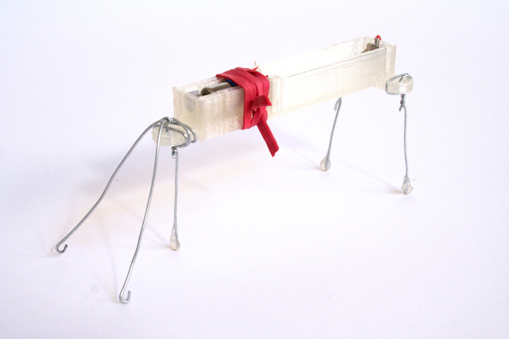

# BuzzBots: Unleash Your Creativity with Tiny, Buzzing Robots

Bring your imagination to life with BuzzBots, a modular vibration-actuated toolkit that lets you build anything from walking creatures to rumbling machines!

## History

I developed this toolkit back around 2012-2014. You can read about it on my website:

https://www.andrewfrueh.com/buzzbots/ 

Here's an early prototype made with a popsicle stick.

Then you can see it progress...

and progress...

... to the final form.

## What are BuzzBots?

- Modular construction: Bolt together 3D-printed parts and tiny vibromotors to create unique BuzzBots.
- Endless possibilities: Experiment with different shapes, movements, and functions.
- Perfect for all skill levels: Easy to assemble for beginners, yet open-ended for creative exploration.

## Why BuzzBots?

- Ignite creativity: Explore the world of robotics and design in a fun and engaging way.
- Learn STEM skills: Experiment with mechanics, vibration, and basic circuitry.
- Build community: Share your creations and ideas with other BuzzBot enthusiasts.

## Get Started Today!

- Download the files: 
    - Clone this repo to access the BuzzBot designs and instructions, or...
    - Download the STL files individually from the "print ready files" folder
- 3D print the parts: Bring your BuzzBots to life with a standard 3D printer.
- Assemble and play: Grab some M3 bolts and nuts, a single AAA battery, and let your imagination run wild!

## Join the BuzzBot Movement!

- Share your creations: Show off your BuzzBots on social media or our community forum.
- Give feedback: Your input helps guide the development.

Ready to create some buzz? Let's get building!

[full disclosure: written with help from Google Bard, 2024-01-27... certainly I would not have written "create some buzz"... OMG]